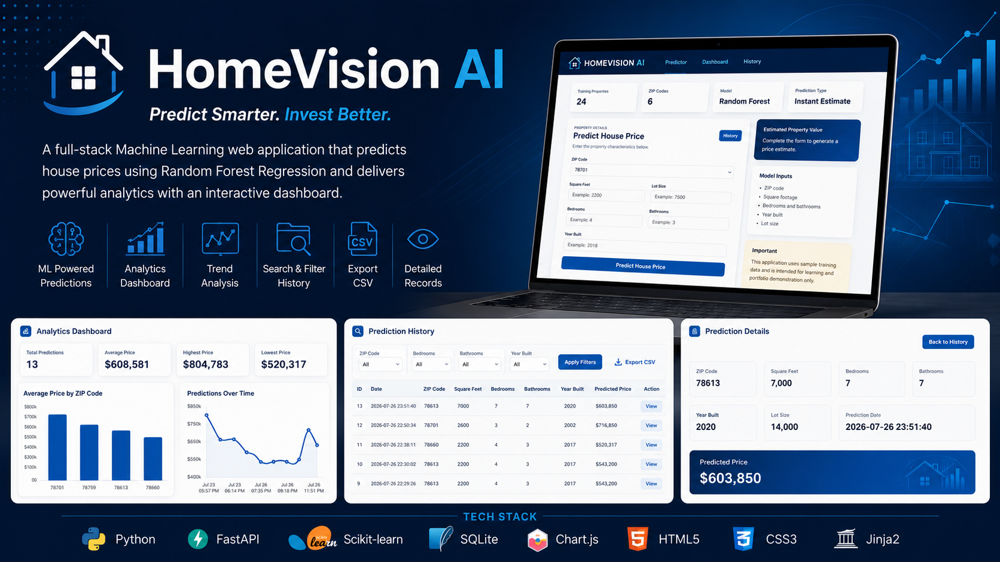
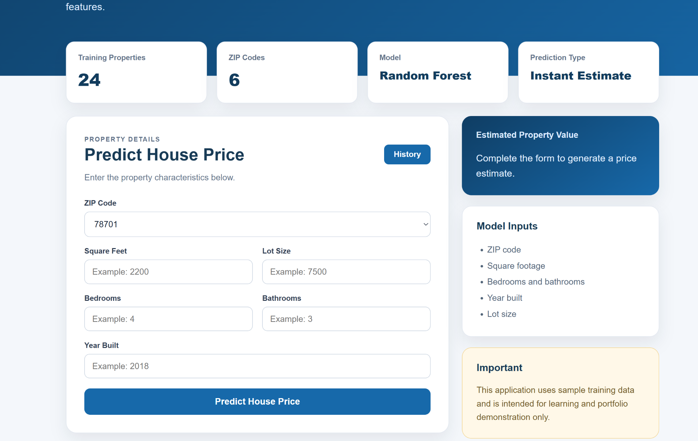
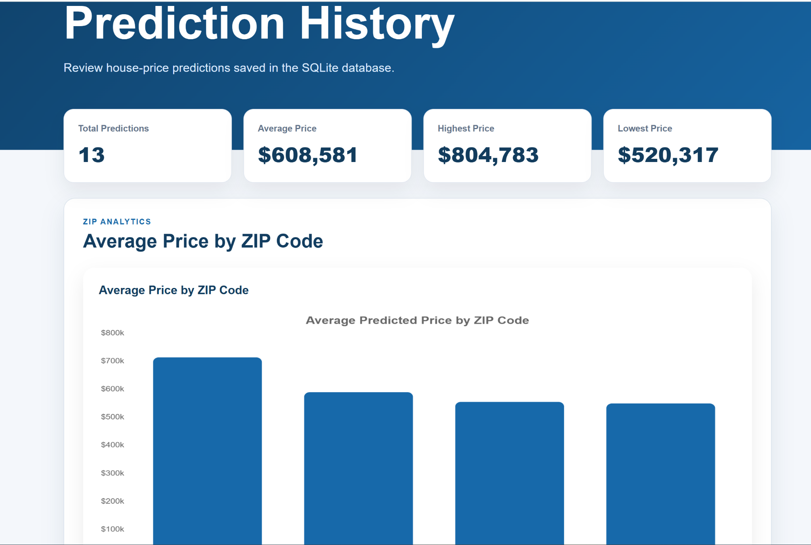
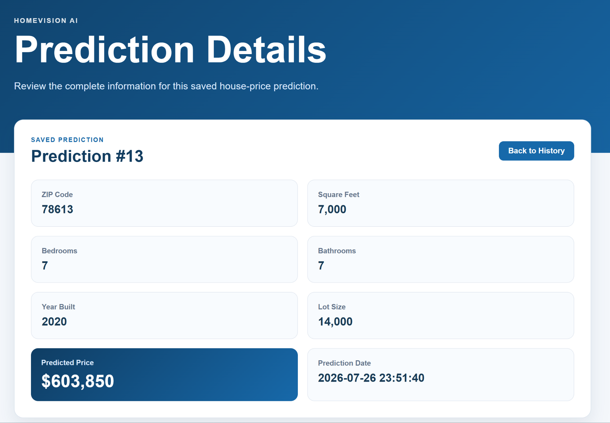

# 🏡 HomeVision AI



> A full-stack Machine Learning web application that predicts residential property prices using **FastAPI**, **Random Forest Regression**, **SQLite**, and an interactive analytics dashboard.

---

## 🚀 Features

- 🏠 Predict house prices instantly using a trained Machine Learning model
- 📊 Interactive analytics dashboard with summary statistics
- 📈 Prediction trends visualized over time using Chart.js
- 🗂️ SQLite database for storing prediction history
- 🔍 Search and filter predictions by ZIP code, bedrooms, bathrooms, and year built
- 📄 Export prediction history to CSV
- 👁️ View detailed information for each saved prediction
- 📱 Modern responsive user interface
- ⚡ Built with FastAPI for high performance

---

# 📸 Application Screenshots

## 🏠 Home Price Predictor

Generate real-time house price estimates based on property features.



---

## 📊 Analytics Dashboard

Visualize prediction statistics, average prices by ZIP code, and prediction trends.



---

## 📋 Prediction History

Browse saved predictions, filter records, export results, and view individual prediction details.


---

## 🔎 Prediction Details

Inspect every saved prediction with complete property information.



---

# 🛠️ Tech Stack

| Category | Technologies |
|-----------|--------------|
| Backend | FastAPI |
| Machine Learning | Scikit-learn (Random Forest Regression) |
| Database | SQLite |
| Frontend | HTML5, CSS3, Jinja2 |
| Charts | Chart.js |
| Language | Python |

---

# 📁 Project Structure

```text
HomeVision-AI
│
├── app/
├── database/
├── model/
├── static/
├── templates/
├── images/
├── main.py
├── requirements.txt
├── README.md
└── .gitignore
```

---

# ⚙️ Installation

Clone the repository

```bash
git clone https://github.com/Deepa-Dwivedi/HomeVision-AI.git
```

Navigate to the project

```bash
cd HomeVision-AI
```

Create a virtual environment

```bash
python -m venv venv
```

Activate the virtual environment

### Windows

```bash
venv\Scripts\activate
```

Install dependencies

```bash
pip install -r requirements.txt
```

Run the application

```bash
python -m uvicorn main:app --reload
```

Open your browser and visit:

```
http://127.0.0.1:8000
```

---

# 📊 Machine Learning Model

- **Algorithm:** Random Forest Regressor
- **Problem Type:** Regression
- **Target Variable:** House Price
- **Features Used:**
  - ZIP Code
  - Square Feet
  - Bedrooms
  - Bathrooms
  - Year Built
  - Lot Size

---

# 🎯 Future Enhancements

- User authentication
- Cloud deployment (Azure / AWS / Hugging Face)
- Interactive map visualization
- Model retraining interface
- REST API documentation (Swagger enhancements)
- Dark mode
- Property image upload
- Price comparison dashboard

---

# 👩‍💻 Author

## Deepa Dwivedi

Data Analyst • Machine Learning • FastAPI • Python • Data Visualization

**GitHub**

https://github.com/Deepa-Dwivedi

**LinkedIn**

https://www.linkedin.com/in/deepa-dwivedi-tamu/

---

## ⭐ Support

If you found this project useful, please consider giving it a ⭐ on GitHub.

It helps others discover the project and supports my work.


